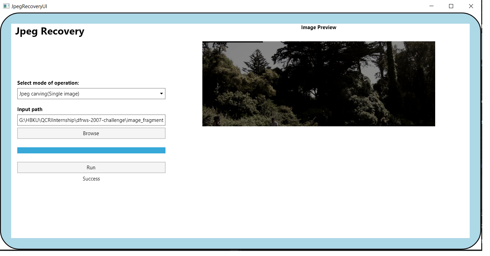

# jpgscraper
JpgScraper: An Advanced Carver for Baseline JPEG Files

     

## Features
* Four modes of operation:   
&ensp; 1) Single image carving from fragment of jpeg  
&ensp; 2) Storage carving of files recovered from media  
&ensp; 3) Network packets carving  
&ensp; 4) Check if an image fragment is jpeg or not  

* Extracts huffman tables if available in file fragment and saves it for future use.

* Display extracted image in the GUI window (supports only Jpeg Carving(Single image) mode for now )

## How to use
This project was tested on Windows 10 and has two parts, a CLI program (mostly for experimenting) and a GUI. The GUI has been compiled and can be executed form the bin folder, to use it follow the following steps:
* Select a mode from the three modes of operation (e.g Jpeg Carving(Single image))
* Select input file path (e.g choose raw_dragon from Sampledata folder given in this repository)
* Click on run
* Enjoy the results!

## Sample data
The sampleData folder contains an image fragment that can be used in Jpeg Carving(Single image)) mode. For more data try DFRWS 2007 dataset for storage carving or getting network packets with jpeg images. Currently the tool only supports baseline jpeg images.

## For developers
The project was build using Visual Studio 2019 and Windows 10.
The source code is divided into two layers:
* Frontend layer: GUI and CLI are part of this
* Backend layer: Contains all the necessary logic to 

To understand and contribute, start by reading the Jpeg standard and the papers given in citation
* JPEG compression specification by the International Telecommunication Union (ITU) as Recommendation T.81 (https://www.w3.org/Graphics/JPEG/itu-t81.pdf)

## Dependencies
* .NET Core 3.1 for GUI
* .NET framework 4.7.2 for CLI 
* .NET standard 2.0 for backend
* Newtonsoft.Json
* MathNet.Numerics
* Sharppcap

## Developed by
- Ahmed Aziz              

## Credits
Credits go to the original authors of JpgScraper, original paper mentioned in citation, AvaloniaUI and others.

## Resources
This is a wrapper repository introducing tools used and proposed in following papers. Please cite properly.
* [jpeg-classifier-csharp-source](https://github.com/euzun/jpgscraper/tree/master/jpeg-classifier-csharp-source): A C# tool to discriminate encoded JPEG data from 993 different file data types. Coming soon!
* [jpeg-carver-csharp-source](https://github.com/euzun/jpgscraper/tree/master/jpeg-carver-csharp-source): Source code of JpgScraper C# toolbox.
* [jpeg-carver-csharp-exe](https://github.com/euzun/jpeg-carver-csharp): A C# toolbox to recover orphaned fragment (without any header information) data. Data is searched and recovered from given data file (100 times faster than Matlab implementation).
* [jpeg-carver-matlab](https://github.com/euzun/jpeg-carver-matlab): A Matlab toolbox to recover orphaned fragment (without any header information) data. Data is given as binary or hexadecimal string.
* [flickr-crawler](https://github.com/euzun/flickr-crawler): A java tool for crawling and downloading public images from Flickr by keywords, geo-locations etc.

## To-do
* Improve performance
* Do not store temp files or give an option to store fragment binaries recovered
* Improve loading progress bar to give real-time loading status.

## Citation
* Please cite to following papers if you use this tool for academic purpose;

* E. Uzun and H. T. Sencar, “[JpgScraper: An Advanced Carver for JPEG Files](https://doi.org/10.1109/TIFS.2019.2953382)”, IEEETransactions on Information Forensics and Security, 2019.

* E. Uzun and H. T. Sencar, “[Carving orphaned jpeg file fragments](https://www.researchgate.net/publication/275044127_Carving_Orphaned_JPEG_File_Fragments)”, IEEETransactions on Information Forensics and Security, vol. 10, no. 8, pp.1549–1563, 2015.
